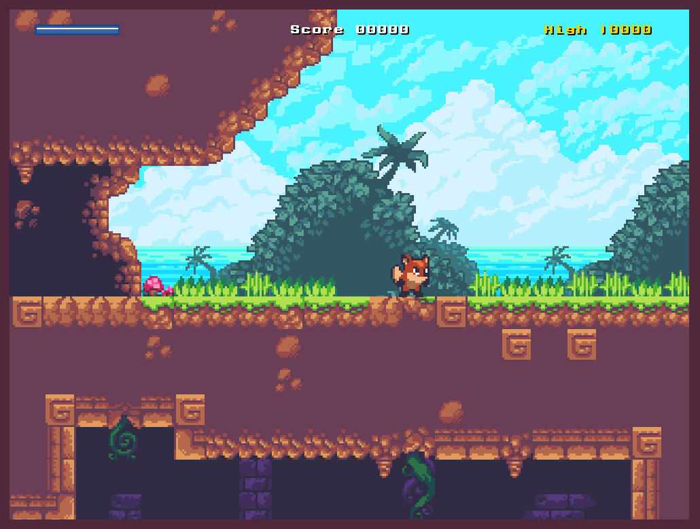

# Sunny Land — A WebGL Playground platformer

Sunny Land is both a learning experiment and ongoing project to showcase Elm's [WebGL Playground package][1] potential.

[PLAY ONLINE][4]



## Goals

It aims to have a fairly complete feature set found in typical 80's platformers:

- A simple 2d physics engine
- Different game entities: player, enemies and bonus items
- Whole screen graphic FX
- Enemy respawn logic
- Game over screen (to-do)
- Multiple levels (to-do)

## Run locally

Clone the repo and on the command line run Elm's `reactor`:

```
elm reactor
```

Then point your browser to <http://localhost:8000/src/Main.elm>

## How this thing works

### Initialisation

Depending on `Memory.status` value an intro screen or a game level is shown.

After the intro screen and before playing (and for every level change) entities are spawned using information found in `Level.spawns` and assigned to `Memory.entities` dictionary. When entities are ready the game loop can run.

One useful trick is to assign a know value (zero) to the player entity ID, so it can be easily retrieved later. 

### Game loop

At each frame the `Main.update` function is executed the following steps are performed:

1. All the game entities are updated. In particular, during this step user input is captured and accelaration for the NPC's (non-player characters) is set.
2. The physics simulation is run to figure out the next positions for all the entities taking any contacts into account.
3. The list of contacts resulting from step (2) is finally used to perform any game logic.

### Physics engine

The physics code has been adapted from the particle engine found in _[Game Physics Engine Development][2]_ book by Ian Millington. It handles contact detection and resolution between circles and circles against line segments.

To handle contacts each physics body (game entity) has an associated circle shape (defined by `radius`), while ground and walls are defined by line segments. 

The `Physics` module knows very little about the game itself, so it can be easily extracted and used on another project. Strictly speaking a physics body needs only a subset of `Entity` fields, hence it is defined as an extensible record:

```
type alias PhysicsBody a =
    { a
        | id : Int
        , p : Vec2
        , v : Vec2
        , a : Vec2
        , radius : Float
        , restitution : Float
        , contact : Vec2
        , contactTestBitMask : Int
        , categoryBitMask : Int
        , affectedByGravity : Bool
        , affectedByContact : Bool
    }
```

The entry point of the physics engine is the `Physics.step` function. At each frame the `step` function is called accepting the current level walls and physics bodies and it takes care of:

1. Apply forces (gravity and ground friction) to each body, and update velocity accordingly.
1. For each physics body figure out contacts with walls and other bodies, ignoring duplicated contacts. In other words, if there was a A-B contact there's no need to generate its twin B-A contact.
1. Resolve contacts one after another, applying impulses to separate affected bodies and fixing interpenetrations.
1. Returns to caller the updated bodies and a list of generated contacts.

### Game logic handling

Each `Contact` is defined as a custom type:

```
type Contact a
    = BetweenBodies Int Int ContactData
    | WithWall Int ContactData
```

While looping through the contact list, `WithWall` values are discared while `BetweenBodies` are passed to `Entity.respond` function. This function figures out what to do next doing a case/of on `Entity.type_` fields, i.e. when player hits an enemy the game needs to decide if the former stomped the latter or got hit:

```
respond id1 id2 contact memory =
    case ( Dict.get id1 memory.entities, Dict.get id2 memory.entities ) of
        ( Just entity1, Just entity2 ) ->
            case ( entity1.type_, entity2.type_ ) of
                ( Player, Opossum ) ->
                    -- Player touched Opossum enemy
                    ...
```

### Level design

Game levels are designed using [Tiled][3], saved to JSON files and then converted into Elm code via a Python script (see `Levels.elm`). You can open `assets/level1.json` with Tiled and see how the various level layers are used to define the terrain, the obstacles and spawn points for the game entities.

## Credits

Game art by Ansimuz <https://ansimuz.itch.io/sunny-land-pixel-game-art>

[1]: https://package.elm-lang.org/packages/justgook/webgl-playground/latest/
[2]: https://www.amazon.it/Game-Physics-Engine-Development-Commercial-Grade/dp/0123819768
[3]: https://www.mapeditor.org
[4]: https://lab.passiomatic.com/sunny-land/